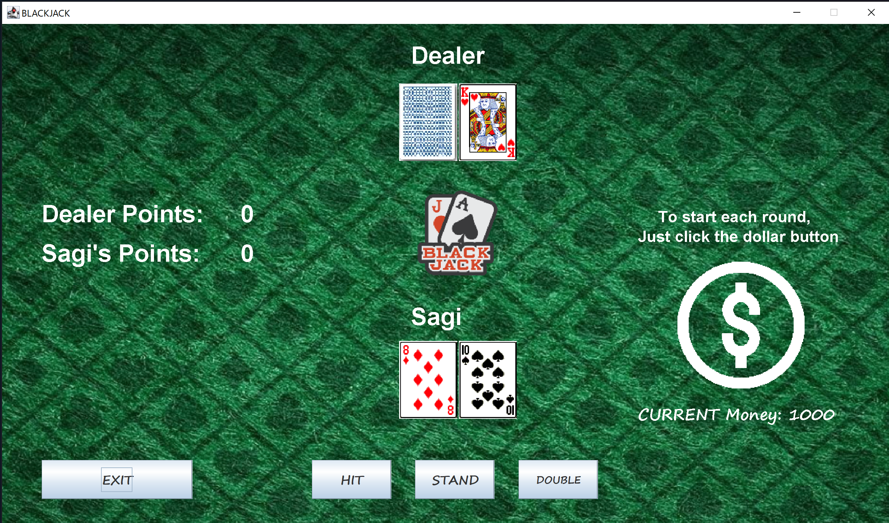
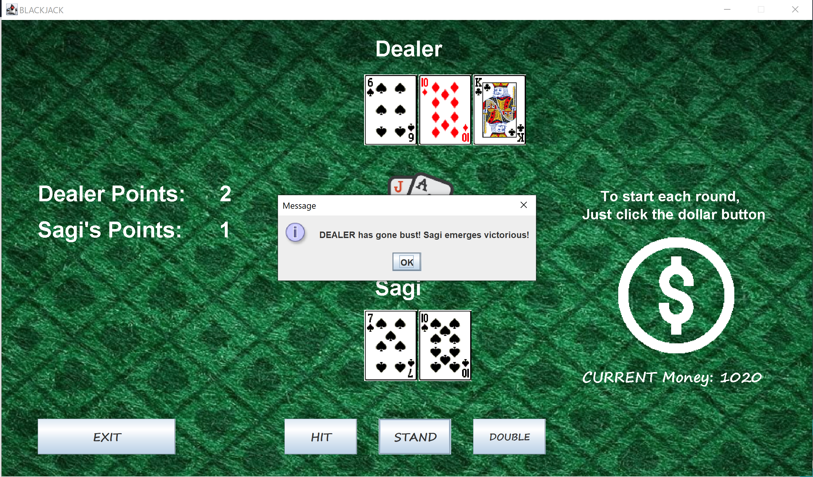
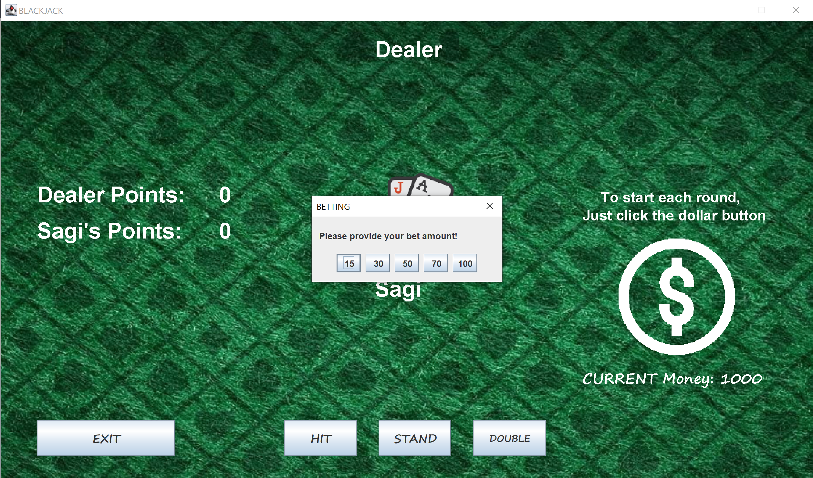
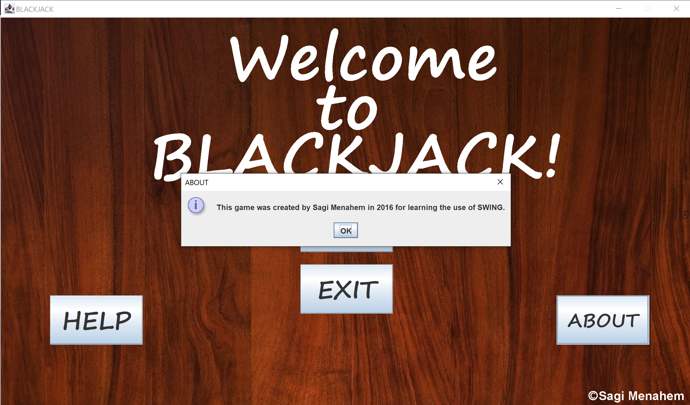
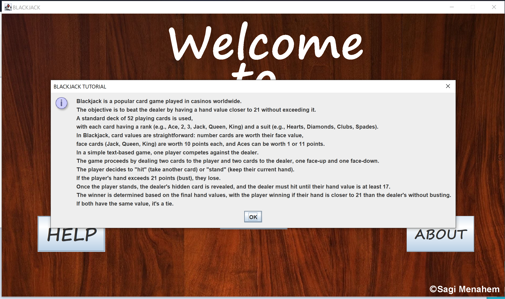

# Blackjack Game

Welcome to the exciting world of Blackjack! This Java Swing-based Blackjack game allows you to enjoy the thrill of the casino from the comfort of your computer.

## Table of Contents

- [Game Overview](#game-overview)
- [Features](#features)
- [Installation](#installation)
- [How to Play](#how-to-play)
- [About the Game](#about-the-game)
- [Screenshots](#screenshots)

## Game Overview

Blackjack, also known as 21, is one of the most popular card games in the world. The objective is simple: beat the dealer by having a hand value closer to 21 without exceeding it. This Blackjack game adheres to the standard rules of the game, including:

- A standard deck of 52 playing cards with ranks (Ace, 2, 3, ..., King) and suits (Hearts, Diamonds, Clubs, Spades).
- Card values: Number cards are worth their face value, face cards (Jack, Queen, King) are worth 10 points each, and Aces can be worth 1 or 11 points.
- Dealing two cards to the player and two cards to the dealer, one face-up and one face-down.
- Player decisions: "Hit" (take another card) or "Stand" (keep the current hand).
- Dealer's hidden card is revealed when the player stands, and the dealer must hit until their hand value is at least 17.
- Determining the winner based on final hand values.

## Features

- A user-friendly Java Swing GUI for an immersive gaming experience.
- Realistic card graphics and animations.
- Interactive buttons for actions (Hit, Stand, Double).
- Player's balance tracking.
- Player's name input.
- In-game tutorials (How to Play, About the Game).

## Installation

1. Open the project in your favorite Java IDE.

2. Compile and run the Main.java file to start the game.

## How to Play

1. Launch the game and enter your name when prompted.

2. Click the "PLAY" button to enter the Blackjack table.

3. To start a round, click the dollar sign icon to place a bet.

4. Choose your actions: "HIT" to take another card, "STAND" to keep your hand, or "DOUBLE" to double your bet and take one more card.

5. The dealer will play their hand automatically.

6. The game will declare the winner, and your balance will be updated accordingly.

## About the Game

This Blackjack game project was created by Sagi Menahem in 2016 as a pre-army project to learn programming in Java and explore the principles of Swing GUI development.

If you have any questions or suggestions, please contact sagiia1997@gmail.com.

## Screenshots

